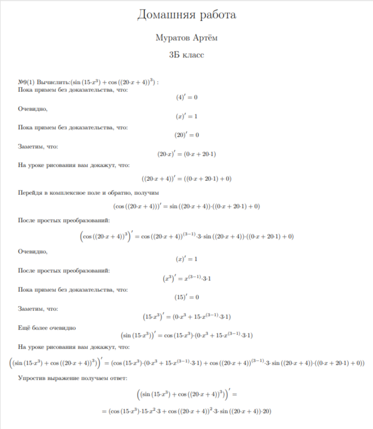

# Differentiator

## Contents
- [0. Introduction](#introduction)
- [1. Program](#program)
- [2. Backend](#backend)
- [3. Tools](#tools)
- [4. Syntax](#syntax)

## Introduction
My program differentiator takes an expression as input and differentiates it. Also it convolves constants and removes neutral expressions. The program output generates a LaTex file with step-by-step solution and funny comments. You can see example of output in Figure 1. This PDF file was made in Overlief from .tex file that was generated by my program differentiator.

## Program
the program is based on the structure of a binary tree, each node of which is an operator, variable or number

  
  <div align="center"> Fig. 1. Example output of my program Differentiator. It was made in Online LaTex Editor Overlief from .tex file that was generated by my program.</div><br>

```C
if (node->value == MUL)
{
    node_t* node_diff = _ADD(
                            _MUL(
                                Differentiator (expr, node->left),
                                Copy (node->right)),
                            _MUL(
                                Copy (node->left),
                                Differentiator (expr, node->right)));
    return node_diff;
}
if (node->value == DIV)
{
    node_t* node_diff = _DIV(
                            _SUB(
                                _MUL(
                                    Differentiator (expr, node->left),
                                    Copy (node->right)),
                                _MUL(
                                    Copy (node->left),
                                    Differentiator (expr, node->right))),
                            _DEG(
                                Copy (node->right),
                                _NUM(2)));
    return node_diff;
}
```
