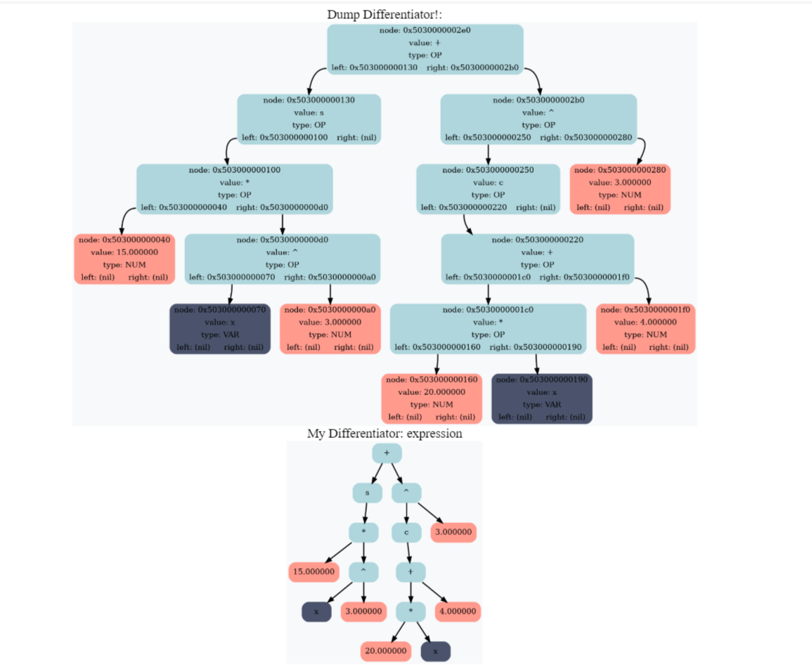

# Differentiator

## Contents
- [0. Introduction](#introduction)
- [1. Program](#program)
- [3. Tools](#tools)

## Introduction
My program differentiator takes an expression as input and differentiates it. Also it convolves constants and removes neutral expressions. The program output generates a LaTex file with step-by-step solution and funny comments. You can see example of output in Figure 1. This PDF file was made in Overlief from .tex file that was generated by my program differentiator.

  
  <div align="center"> Fig. 1. Example output of my program Differentiator. It was made in Online LaTex Editor Overlief from .tex file that was generated by my program.</div><br>


## Program
The program is based on the structure of a binary tree, each node of which is an operator, variable or number. Firstly it read .txt file and make this tree. Then the program differentiates all expressions in recursion (function Differentiator). For example you can see differentiation of operator DIV (dividing) in block of code.
``` C
if (node->value == DIV)
{
    node_t* node_diff = _DIV(
                            _SUB(
                                _MUL(
                                    Differentiator (expr, node->left),
                                    Copy (node->right)),
                                _MUL(
                                    Copy (node->left),
                                    Differentiator (expr, node->right))),
                            _DEG(
                                Copy (node->right),
                                _NUM(2)));
    return node_diff;
}
```
It have DSL: special defines, for example _SUB, that call func NewNode and made node with type "operator", value '-', and left and right children from arguments. Also it have defines _NUM and _VAR for making nodes with type number and variable.

After full differentiation the binary tree is simplified by convolution of constants and removal of neutral elements. And a LaTEx file is generated from the executed tree.

## Tools
While writing the code, I used a graphical dump for debugging. I made it using Graphviz. Function DifferentiatorGraphviz generated .dot file and with help of call system made picture of my tree. Example of graphical dump you can see in Figure 2.

  
  <div align="center"> Fig. 2. Graphic dump that was made using Graphviz. Blue nodes have type operator, red - number, dark - variable. Also there are some information about nodes, for exaple their pointers, value, type and pointers of children. Value 'c' means 'cos', 's' - 'sin'.</div><br>

